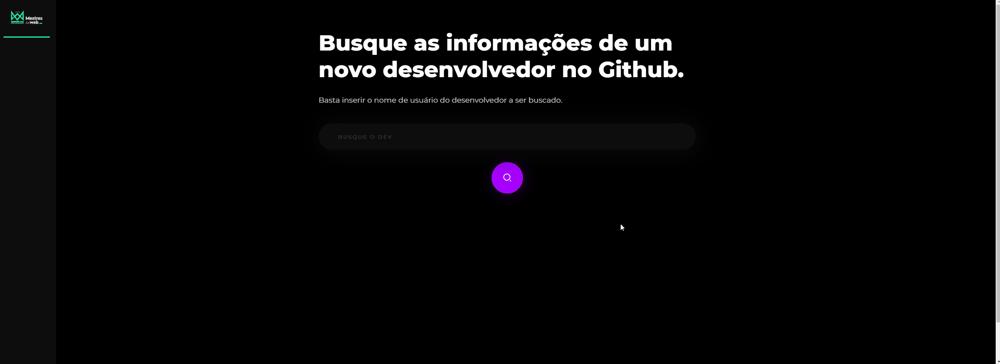
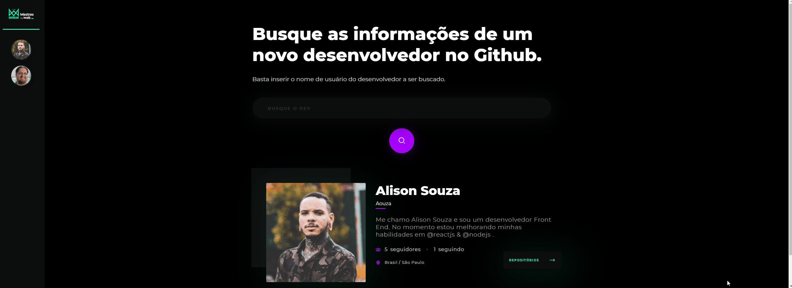

<h1 align="center">
    
    <br>
    Mestres da Web
</h1>

<h4 align="center">
  Plataforma para buscar informações de desenvolvedores no GitHub.
</h4>

<p align="center">
 <a href="#four_leaf_clover-tecnologias-utilizadas">Tecnologias utilizadas</a> •
 <a href="#rocket-subindo-a-aplicação">Subindo a aplicação</a>
</p>

<h2 align="center">
  
</h2>

<br />

<h2 align="center">
  
</h2>

## :four_leaf_clover: Tecnologias utilizadas

Esse projeto está sendo desenvolvido com as seguintes tecnologias.

-   [ReactJS](https://reactjs.org/)
-   [Typescript](https://www.typescriptlang.org/)
-   [Axios](https://github.com/axios/axios)
-   [react-router-dom](https://github.com/ReactTraining/react-router)
-   [styled-components](https://www.styled-components.com/)
-   [React-Icons](https://react-icons.github.io/react-icons/)
-   [VS Code][vc]

## :rocket: Subindo a aplicação

Para clonar e subir a aplicação, é necessário ter o [Git](https://git-scm.com) e o [Node.js][nodejs] instalados em sua máquina.

```bash
# Faça um clone da aplicação.
$ git clone https://github.com/Aouza/master-github

# Vá até o repositório.
$ cd master-github

# Instale as dependências.
$ yarn

# Ou
$ npm install

# Suba a aplicação.
$ yarn start

# Ou
$ npm run start

```

---

[Alison Souza no LinkedIn](https://www.linkedin.com/in/alisonsouza/)

[nodejs]: https://nodejs.org/
[yarn]: https://yarnpkg.com/
[vc]: https://code.visualstudio.com/
